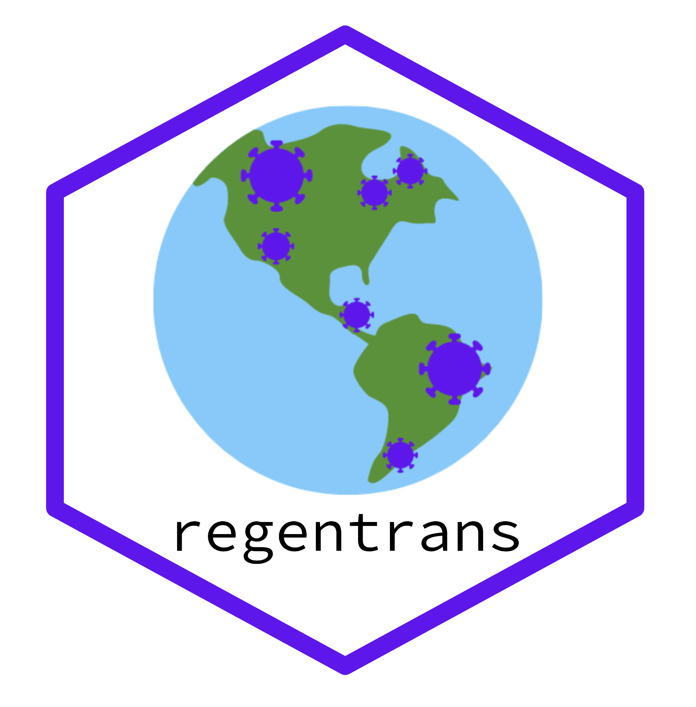

# regentrans: R package for investigating regional pathogen transmission using genomic data

Website: https://snitkin-lab-umich.github.io/regentrans/

`regentrans` can be installed using the command `devtools::install_github('Snitkin-Lab-Umich/regentrans')` in R 

Examples of how to interrogate all of the questions in the table below can be found in the [introductory vignette](https://snitkin-lab-umich.github.io/regentrans/articles/Introduction.html).

Questions regentrans can help investigate:

| Question | Method | regentrans function(s) | Required Data | Optional Data
|---|---|---|---|---|
|How do you choose pairwise SNV distance thresholds?| Fraction of intra-facility pairs for different pairwise SNV distances |`get_frac_intra()`|output of `get_pair_types()`| |
| Is transmission occurring within and/or between locations? | Phylogenetic clustering of isolates from the same location | `get_clusters()` | Phylogenetic tree, isolate location information | |
| | Pairwise SNV distances within and between facilities | `get_pair_types()` | A pairwise SNV distance matrix (can be created using `ape::dist.dna()` on fasta file of variants), isolate location information | |
| What locations is transmission occurring within/between? | Population-level similarity between locations (Fsp) | `get_facility_fsp()` | Fasta file of variants, isolate location information | |
| | Number of closely related pairs within and between facilities | Plot code in vignette |  |  |
| Have transmission dynamics changed over time? | Methods above but split over time | | | |
| Is transmission occurring along paths of higher patient/person flow? | Compare patient/person flow between locations to inter-location pairwise SNV distances or Fsp | `get_patient_flow()`| Patient transfer network edge matrix | |
| | Compare patient/person flow between locations to populatoin-level similarity between locations | `get_patient_flow()`, `get_facility_fsp()`| Patient transfer network, fasta file of variants, isolate location information | |
| Are there any observable geographic trends in prevalence/transmission? | Visualize prevalence and closely related pairs or Fsp | Plot code in vignette | Geographic locations of each facility, patient transfer network, summary metric of genomic similarity | |
